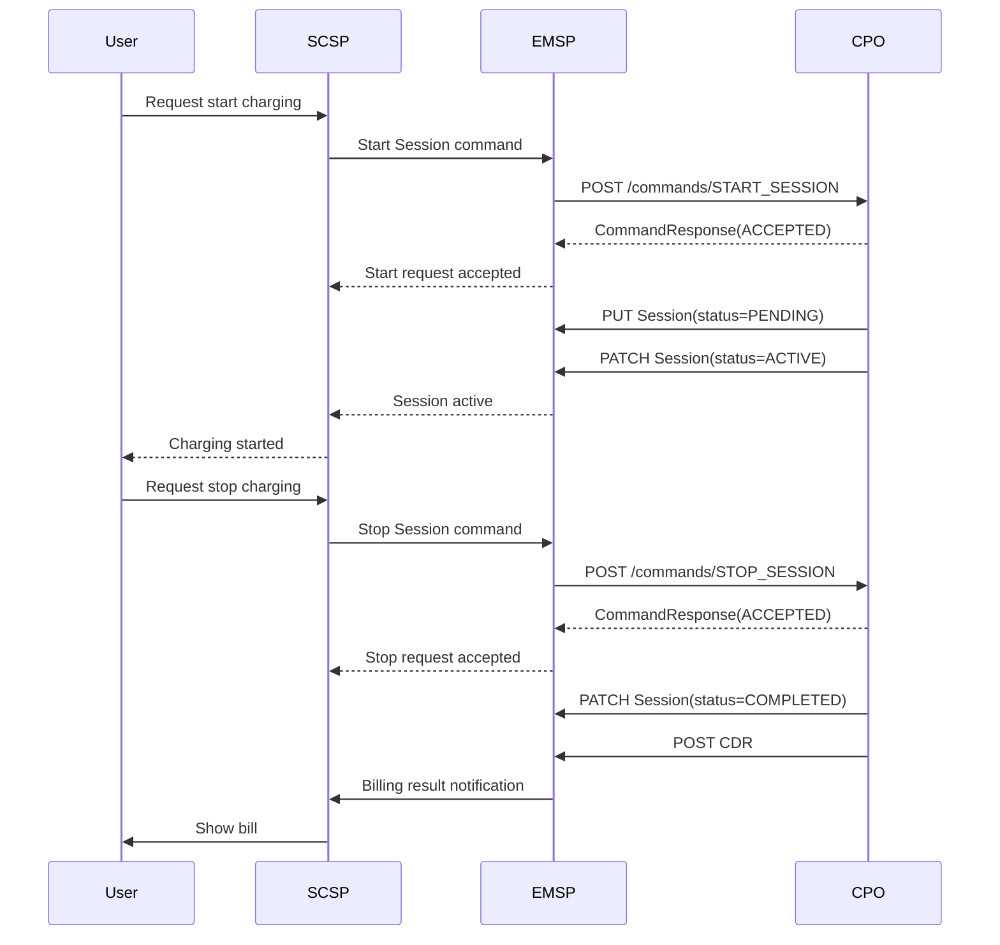

# 本專案會用到的 OCPI 摘要

來源：`resource/OCPI-2.2.1.pdf`

本文件只整理本專案題目會用到的 OCPI 2.2.1 概念，重點放在「SCSP 透過 EMSP 請求 CPO 啟停充電，CPO 回傳 Session 與 CDR」的流程。完整規格仍以原 PDF 為準。

## 角色對照

- User：使用第三方 App 的終端用戶，不是 OCPI 標準角色。
- SCSP：Smart Charging Service Provider，題目中的第三方 App/API 呼叫方。
- EMSP：E-Mobility Service Provider，面向使用者或 SCSP，負責漫遊、授權與帳務彙整。
- CPO：Charge Point Operator，擁有充電站、充電樁與充電 Session/CDR 資料。
- Charge Point：實際充電設備。題目時序圖可以把它省略，或作為 CPO 內部設備呈現。

## OCPI 回應格式

OCPI API 的 response body 通常會包成下列格式：

```json
{
  "data": {},
  "status_code": 1000,
  "status_message": "Success",
  "timestamp": "2026-06-08T00:00:00Z"
}
```

常用狀態碼：

- `1000`：成功。
- `2000`：一般 client error。
- `2001`：參數無效或缺少必要參數。
- `2003`：Unknown Location，例如對未知充電站發送 `START_SESSION`。
- `3000`：一般 server error。
- `4001`：Hub routing 時找不到接收方。
- `4002`：Hub routing timeout。
- `4003`：接收方連線問題。

HTTP 與 OCPI status code 分工：

- JSON 語法錯誤等 transport layer 問題使用 HTTP error，例如 `400 Bad Request`。
- JSON 可解析且進入 OCPI layer 後，應回 OCPI response body，用 `status_code` 表示業務處理結果。

## Commands Module

Module Identifier：`commands`

本題主要會用到：

- `START_SESSION`
- `STOP_SESSION`

### Receiver Interface

通常由 CPO 實作，讓 EMSP 發送命令給充電設備。

Endpoint 結構：

```text
{commands_endpoint_url}/{command}
```

範例：

```text
POST /ocpi/cpo/2.2/commands/START_SESSION
POST /ocpi/cpo/2.2/commands/STOP_SESSION
```

這個 POST 的同步 response 只代表 CPO 是否接收並嘗試轉送命令，不代表充電樁最後執行成功。

### Sender Interface

通常由 EMSP 實作，用來接收 CPO 從充電設備取得的非同步命令結果。

OCPI 不固定 URL 結構。EMSP 會在 command request body 的 `response_url` 放入 callback URL，CPO 之後用該 URL 回傳 `CommandResult`。

實作上建議每次 command 都使用唯一 `response_url`，例如：

```text
POST /ocpi/emsp/2.2/commands/START_SESSION/{command_id}
POST /ocpi/emsp/2.2/commands/STOP_SESSION/{command_id}
```

### StartSession

`StartSession` 是 EMSP 要求 CPO 啟動充電的 command body。

常用欄位：

- `response_url`：CPO 回傳非同步 `CommandResult` 的 URL。
- `token`：用來啟動 Session 的 Token。題目可忽略 token 認證細節，但流程上仍可保留 Token 或 user reference。
- `location_id`：要啟動充電的 Location ID。
- `evse_uid`：可選，指定 EVSE。
- `connector_id`：可選，指定 Connector；若 EVSE 有 `START_SESSION_CONNECTOR_REQUIRED` capability 則必要。
- `authorization_reference`：可選，EMSP 授權參考值。若提供，Session/CDR 應帶回相同 reference。

簡化 request 範例：

```json
{
  "response_url": "https://emsp.example.com/ocpi/2.2/commands/START_SESSION/cmd-001",
  "token": {
    "uid": "app-user-001",
    "type": "APP_USER",
    "contract_id": "TW-EMS-USER001"
  },
  "location_id": "LOC-001",
  "evse_uid": "EVSE-001",
  "connector_id": "1",
  "authorization_reference": "auth-001"
}
```

同步 response 範例：

```json
{
  "data": {
    "result": "ACCEPTED",
    "timeout": 30
  },
  "status_code": 1000,
  "status_message": "Success",
  "timestamp": "2026-06-08T00:00:00Z"
}
```

### StopSession

`StopSession` 是 EMSP 要求 CPO 停止既有 Session 的 command body。

常用欄位：

- `response_url`：CPO 回傳非同步 `CommandResult` 的 URL。
- `session_id`：要停止的 Session ID。

簡化 request 範例：

```json
{
  "response_url": "https://emsp.example.com/ocpi/2.2/commands/STOP_SESSION/cmd-002",
  "session_id": "session-001"
}
```

### CommandResponse

`CommandResponse` 是 CPO 對 command request 的同步回應。

欄位：

- `result`：`CommandResponseType`。
- `timeout`：等待非同步結果的秒數。
- `message`：可選，人類可讀訊息。

常用 `CommandResponseType`：

- `ACCEPTED`：CPO 接受命令，會嘗試送到充電設備。
- `REJECTED`：CPO 拒絕命令。
- `NOT_SUPPORTED`：CPO、Charge Point 或 EVSE 不支援該命令。
- `UNKNOWN_SESSION`：StopSession 指定的 Session 不存在。

### CommandResult

`CommandResult` 是充電設備執行結果，由 CPO 透過 `response_url` 非同步送回 EMSP。

欄位：

- `result`：`CommandResultType`。
- `message`：可選，人類可讀訊息。

常用 `CommandResultType`：

- `ACCEPTED`：充電設備接受命令。
- `REJECTED`：充電設備拒絕命令。
- `FAILED`：命令執行失敗。
- `TIMEOUT`：等待設備回應逾時。
- `EVSE_OCCUPIED`：EVSE 已被使用。
- `EVSE_INOPERATIVE`：EVSE 故障或不可用。
- `NOT_SUPPORTED`：設備不支援。

## Sessions Module

Module Identifier：`sessions`

Data owner：CPO

Session 描述一筆充電中的或已結束的充電會話。CPO 擁有 Session，並可用 push model 將 Session 送給 EMSP 或 SCSP。

### Push Model

本題會用到 push model：

- CPO 建立 Session 後，用 `PUT` 將新 Session 推送到 EMSP。
- Session 狀態或費用變更時，用 `PATCH` 更新 EMSP 端的 Session。
- Session 不能刪除；結束狀態是 `COMPLETED`。

Receiver Interface 通常由 EMSP/SCSP 實作。

Endpoint 結構：

```text
{sessions_endpoint_url}/{country_code}/{party_id}/{session_id}
```

範例：

```text
PUT /ocpi/emsp/2.2/sessions/TW/CPO/session-001
PATCH /ocpi/emsp/2.2/sessions/TW/CPO/session-001
```

### Session 重要欄位

- `country_code`：CPO 國家碼。
- `party_id`：CPO party id。
- `id`：CPO 平台中的 Session ID。
- `start_date_time`：Session 變成 `ACTIVE` 的時間；若仍是 `PENDING`，為 Charge Point 建立 Session 的時間。
- `end_date_time`：Session 結束時間。
- `kwh`：已充電量。
- `cdr_token`：啟動 Session 的 Token。
- `auth_method`：授權方式，例如 `COMMAND`、`WHITELIST`。
- `authorization_reference`：EMSP 授權參考值。
- `location_id`：Location ID。
- `evse_uid`：EVSE UID。
- `connector_id`：Connector ID。
- `currency`：幣別，例如 `TWD`。
- `charging_periods`：充電期間與計費維度。
- `total_cost`：目前 Session 費用。
- `status`：Session 狀態。
- `last_updated`：最後更新時間。

### SessionStatus

本題主要用：

- `PENDING`：Session 尚未真正開始，初始狀態。
- `ACTIVE`：Session 已被接受且啟動，所有前置條件已滿足。
- `COMPLETED`：Session 已完成，不再修改。

其他狀態：

- `RESERVATION`：由預約建立，尚未開始充電。
- `INVALID`：Session 無效，不應計費。

### 題目流程中的 Session 更新

啟動充電時可表達為：

```text
CPO -> EMSP: PUT Session(status=PENDING)
CPO -> EMSP: PATCH Session(status=ACTIVE, start_date_time=..., last_updated=...)
```

停止充電時可表達為：

```text
CPO -> EMSP: PATCH Session(status=COMPLETED, end_date_time=..., kwh=..., total_cost=..., last_updated=...)
```

## CDRs Module

Module Identifier：`cdrs`

Data owner：CPO

CDR（Charge Detail Record）描述一筆已結束充電 Session 的計費結果，是 OCPI 中與帳務最直接相關的物件。CDR 在 Session 結束後由 CPO 建立並送給 EMSP。

### 重點規則

- CDR 是 billing-relevant object。
- CDR 由 CPO 建立。
- CDR 應在 Session 結束後盡快送給 EMSP，但 OCPI 不強制即時。
- CDR 一旦送出不可修改、不可取代、不可刪除。
- 若需更正，應送 Credit CDR，再送新的 CDR。

### Push Model

本題會用到 CPO 主動推送 CDR 給 EMSP：

```text
POST /ocpi/emsp/2.2/cdrs
```

EMSP 收到後應回應新建 CDR 的 `Location` header，讓 CPO 未來可用該 URL 查詢。

### CDR 與 Session 差異

- Session：動態物件，用於呈現充電進行中狀態。
- CDR：封存物件，用於帳務與發票/帳單依據。

CDR 應保存 Session 開始當下有效的 Location、EVSE、Tariff、Token 等資訊，避免之後資料異動影響帳務認定。

### 題目流程中的 CDR

停止充電後可表達為：

```text
CPO -> EMSP: POST CDR(session_id, cdr_token, total_energy, total_cost, currency)
EMSP -> SCSP: Notify billing result
SCSP -> User: Show bill
```

## 建議的題目時序圖主線



## 實作時可採用的簡化假設

- 題目允許忽略 token 認證流程，因此不用實作完整 OCPI Credentials/Tokens 模組。
- `CommandForward` 可視為 EMSP 對 CPO `commands` receiver endpoint 的封裝呼叫。
- 若只交時序圖，可將 CPO 與 Charge Point 合併，不必畫 OCPP 內部流程。
- 若要做 API demo，可以用 mock CPO/EMSP 流程模擬 `CommandResponse`、Session push、CDR push。
- SCSP 不是必要 OCPI endpoint 擁有者，可以視為 EMSP 對外提供給 App 的業務 API 呼叫方。
