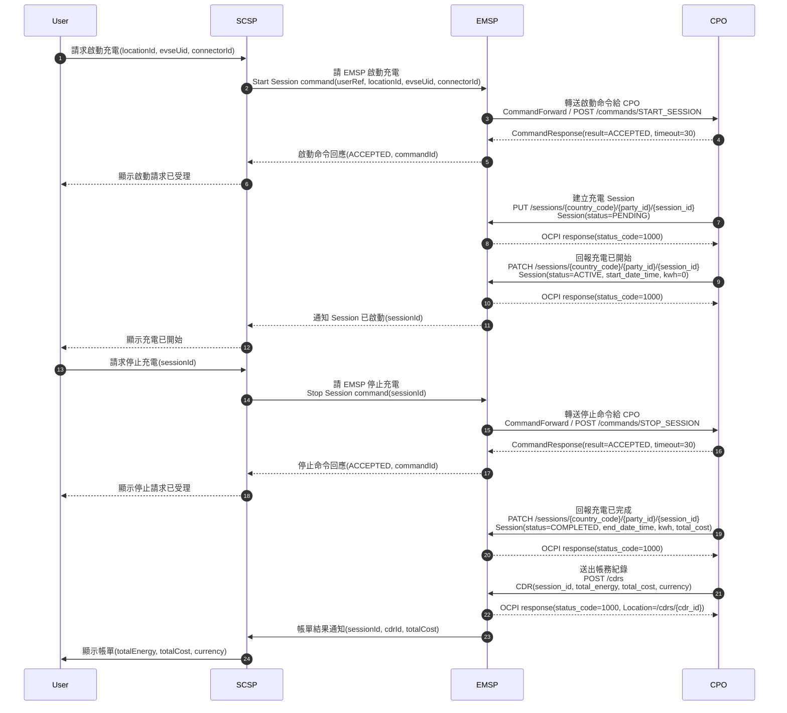

# OCPI 2.2.1 充電流程時序圖

## 角色說明

| 角色 | 說明 |
| --- | --- |
| *User* | *終端使用者，透過第三方 App 操作充電啟停；不是 OCPI 標準角色。* |
| *SCSP* | *Smart Charging Service Provider，題目中的第三方 App / API 呼叫方，對 User 提供操作入口。* |
| *EMSP* | *E-Mobility Service Provider，負責面向 SCSP / User 的漫遊、授權與帳務彙整。* |
| *CPO* | *Charge Point Operator，擁有充電站、充電樁、Session 與 CDR 資料。* |

## Mermaid 時序圖

*圖片輸出：*

- *[SVG 版本](ocpi-sequence.svg)：適合放大檢視或貼到支援 SVG 的文件。*
- *[PNG 版本](ocpi-sequence.png)：適合貼到簡報、文件或無法渲染 Mermaid 的平台。*

## 流程說明

1. *User 在 SCSP App 選擇充電站、EVSE 或 Connector，發起啟動充電。*
2. *SCSP 對 EMSP 發送 Start Session command，EMSP 進行業務授權與漫遊處理後，轉送到 CPO 的 `START_SESSION` command endpoint。*
3. *CPO 同步回傳 `CommandResponse(ACCEPTED)`，代表命令已被 CPO 接收並會嘗試送往充電設備；這不等於充電已經成功開始。*
4. *CPO 建立 Session 並推送給 EMSP，狀態先為 `PENDING`，表示充電會話已建立但尚未真正開始。*
5. *充電設備接受並開始充電後，CPO 再以 Session update 將狀態更新為 `ACTIVE`。EMSP 可通知 SCSP，SCSP 顯示充電已開始。*
6. *User 透過 SCSP 發起停止充電，SCSP 對 EMSP 發送 Stop Session command。*
7. *EMSP 轉送到 CPO 的 `STOP_SESSION` command endpoint，CPO 同步回傳 `CommandResponse(ACCEPTED)`。*
8. *充電停止後，CPO 將 Session 更新為 `COMPLETED`，並帶上結束時間、用電量與目前費用等資訊。*
9. *CPO 依已完成的 Session 建立 CDR，透過 `POST /cdrs` 推送給 EMSP。*
10. *EMSP 根據 CDR 彙整帳務結果並通知 SCSP，最後由 SCSP 向 User 顯示帳單。*

## 主要 API 用途

| API / 訊息 | 用途 |
| --- | --- |
| *Start Session command* | *SCSP 請 EMSP 幫使用者啟動指定充電站、EVSE 或 Connector 的充電流程。* |
| *CommandForward / `POST /commands/START_SESSION`* | *EMSP 將啟動充電命令轉送給實際控制充電設備的 CPO。* |
| *`CommandResponse(ACCEPTED)`* | *CPO 表示已接收命令並會嘗試執行；這是同步受理結果，不代表充電已經開始。* |
| *`PUT /sessions/...`，`Session(status=PENDING)`* | *CPO 建立一筆充電 Session，代表充電會話已建立但尚未真正開始。* |
| *`PATCH /sessions/...`，`Session(status=ACTIVE)`* | *CPO 回報充電設備已開始充電，Session 進入進行中狀態。* |
| *Stop Session command* | *SCSP 請 EMSP 停止指定 `sessionId` 的充電流程。* |
| *CommandForward / `POST /commands/STOP_SESSION`* | *EMSP 將停止充電命令轉送給 CPO。* |
| *`PATCH /sessions/...`，`Session(status=COMPLETED)`* | *CPO 回報充電已結束，並更新結束時間、用電量與目前費用。* |
| *`POST /cdrs`* | *CPO 將最終帳務紀錄 CDR 送給 EMSP，作為帳單或發票依據。* |
| *Billing result notification* | *EMSP 根據 CDR 彙整帳單結果後通知 SCSP，讓 SCSP 顯示給 User。* |

## 關鍵 OCPI 概念

- *`CommandResponse` 是 CPO 對 command request 的同步回應，只表示命令是否被接收，例如 `ACCEPTED`、`REJECTED`、`NOT_SUPPORTED`。*
- *Session 是充電中的動態狀態資料，本題主線使用 `PENDING → ACTIVE → COMPLETED`。*
- *CDR（Charge Detail Record）是充電完成後的帳務資料，由 CPO 建立並送給 EMSP，通常作為帳單與發票依據。*
- *Session 可持續更新；CDR 一旦送出後不可任意修改，若帳務需更正，應用 Credit CDR 或新的 CDR 處理。*
- *`CommandForward` 可視為 EMSP 將 SCSP 的啟停需求轉換並轉送到 CPO OCPI Commands receiver endpoint。*
